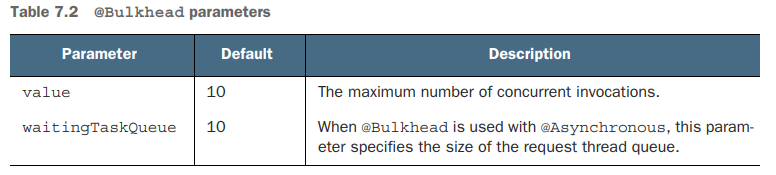
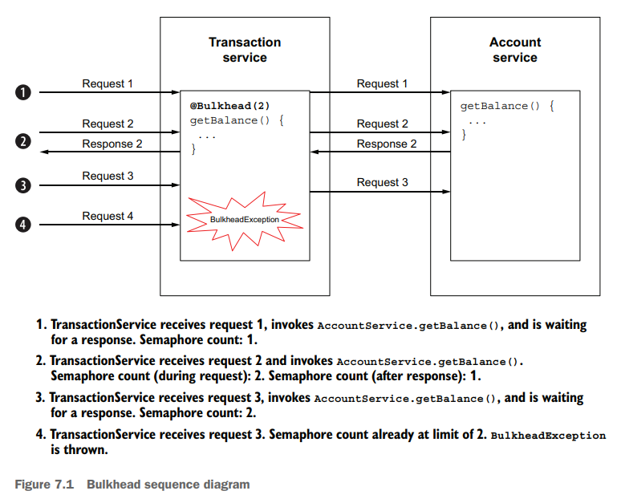
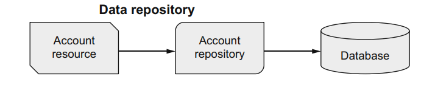

## Resilience strategies

Extension

```xml
<dependency>
    <groupId>io.quarkus</groupId>
    <artifactId>quarkus-smallrye-fault-tolerance</artifactId>
</dependency>
```


### Using _@Asynchronous_

Instead of blocking a worker thread by waiting for a response, the @Asynchronous annotation uses a separate thread to invoke the remote service to increase concurrency and throughput. See
the next code listing for an example.

This book does not advocate using the @Asynchronous annotation with Quarkus and
will not cover the annotation in detail. The @Asynchronous annotation is for runtimes
that make heavy use of threads and thread pools to achieve higher concurrency and
throughput, like Jakarta EE runtimes. Quarkus uses a nonblocking network stack and
event loop execution model based on Netty and Eclipse Vert.x. It can achieve higher
concurrency and throughput using its inherent asynchronous and reactive APIs while
using less RAM and CPU overhead.
For example, the Quarkus RESTEasy Reactive extension enables the use of JAX-RS
annotations and handles requests directly on the IO thread. Developers can use the
APIs they already know while benefiting from the throughput typically reserved for
asynchronous runtimes like Vert.x. 


### Constraining concurrency with bulkheads (paratie)

The bulkhead concept comes from shipbuilding, which constrains a compromised section of a ship’s hull by closing bulkhead doors to isolate the incoming water.
The bulkhead architectural pattern applies this concept to prevent a failure in one service from cascading to another service by limiting the number of concurrent method invocations.
For instance in case of calls to time-consuming external services might cost to exhaust the worker thread pool (specially if applications like Jakarta EE ans Spring use one worker thread per request)

MicroProfile Fault Tolerance specifies bulkheads using the @Bulkhead annotation, which can be applied to either a method or a class. See the next listing for an
example.


```java
//
@Bulkhead(10) 
public String invokeLegacySystem() {
    ...
}
```



The @Bulkhead annotation can be used together with _@Asynchronous_, _@CircuitBreaker_, _@Fallback_, _@Retry_, and _@Timeout_

The values uses a semaphore based on the number of unanswered concurrent request



##  Exception handling with _@Fallback_



